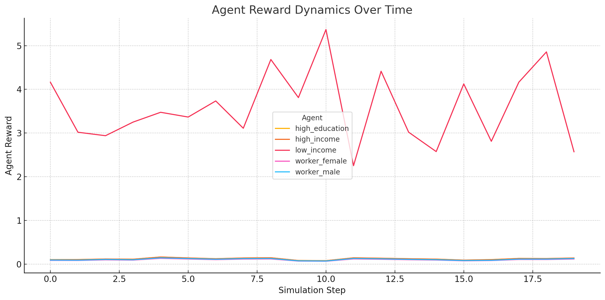

# 🧠 MARL + Voting: Learning Agents in a Simulated Society

This experiment simulates a democratic society of intelligent agents — each representing a different social group — who vote, adapt, and evolve their own values over time.

It blends **multi-agent reinforcement learning** with **collective voting mechanisms** to explore how values emerge, shift, and collide in a political environment.

---

## 🎯 Objective

To simulate how AI agents:
- Learn their internal social values (e.g. fairness, meritocracy)
- Vote on public policies
- Adapt their preferences based on satisfaction with outcomes

This mirrors real-world dynamics where social groups influence — and are influenced by — public policy.

---

## 🧩 Setup

Each agent:
- Is initialized with simplified stats (income, education, age, etc.)
- Maintains a **5-dimensional policy preference vector** over:
  - Meritocracy
  - Fairness
  - Efficiency
  - Age Inclusion
  - Loss Recovery
- Votes for one of several proposed policies (softmax voting)
- Receives a reward based on how well the winning policy served their group
- Updates their internal vector using policy-gradient learning

---

## 🗳️ Simulation Loop

For each of 20 rounds:
1. Random policy proposals are generated
2. Each agent votes for its best match
3. The winning policy is applied
4. Each agent:
   - Evaluates the policy
   - Learns from its reward
   - Logs their internal preferences

All policy vectors are **normalized** so agents must constantly balance their trade-offs.

---

## 📊 Results: Value Shifts Over Time

Each agent's preferences evolved across the simulation:

### 🔴 Low-Income Agent
- Quickly prioritizes **fairness** and **loss recovery**
- Learns to downplay meritocracy and efficiency
- Suggests that the group adapts to maximize support

### 🟣 High-Income & High-Education Agents
- Start with high **meritocracy** and **efficiency** values
- Show some compromise as those policies don’t win often

### 🔵 Worker Agents
- Show mixed trends, possibly reflecting less policy impact or confusion in adapting



---

## 🧠 Interpretation

This simulation captures:
- How **values emerge** from lived experience
- The tension between **redistribution and reward**
- The idea that **justice is dynamic**, not static

It’s a toy society — but it reveals real dilemmas:
- Who shapes policy?
- Who benefits?
- Who adapts to survive?

---

## 🛠️ How to Run

```bash
pip install -r requirements.txt
python simulate.py
```

Results saved to `results/scores.csv`

---

## 🧪 Next Experiments

- Add **strategic voting** (not always vote honestly)
- Introduce **coalition dynamics** or influence weights
- Visualize **value alignment** across time (KL divergence)
- Include human-in-the-loop policy control

---

## 👤 Author

Developed by **Navid Mirnouri**  
[GitHub](https://github.com/navid72m) · [LinkedIn](https://www.linkedin.com/in/navid-mirnouri)

---

## 🔖 Tags

`#MultiAgentSystems` `#PoliticalPhilosophy` `#MARL` `#Simulation` `#SocialAgents` `#AIAlignment` `#ReinforcementLearning` `#VotingSystems`

